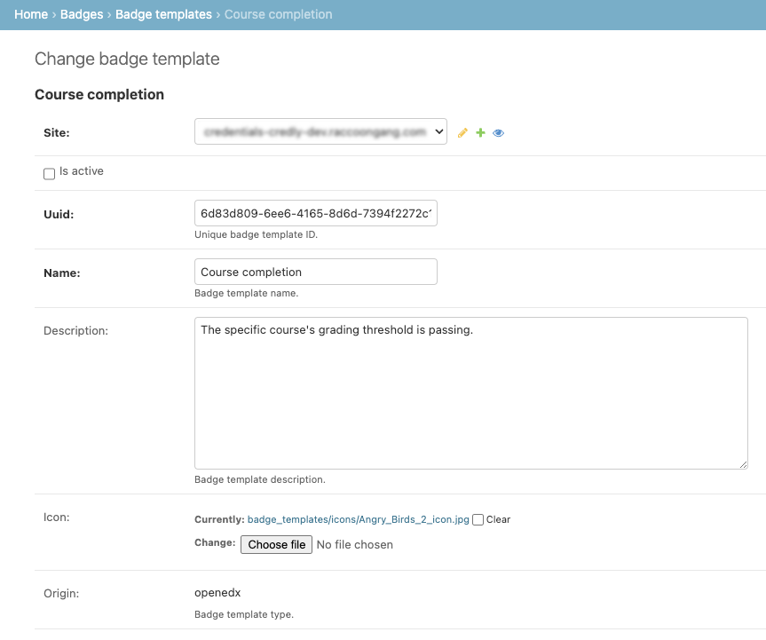

Configuration
=============

Badges feature configuration includes:

- feature settings
- badge templates management
- requirements setup
- backends configuration (optional)

Feature settings
----------------

Badges are under a feature flag (disabled by default):

.. code-block:: sh

    # credentials settings:
    ENABLE_BADGES = SettingToggle('BADGES_ENABLED', default=False)

Also the feature has its configuration which may look like this:

.. code-block:: sh

    # credentials settings:
    BADGES_CONFIG = {
        "event_types": [
            "org.openedx.learning.course.grade.passed.v1",
            "org.openedx.learning.course.grade.failed.v1",
        ],
    }

Configuration describes:

- ``event_types`` - explicitly listed types of *incoming* event bus events (public signals).

Incoming Events configuration
~~~~~~~~~~~~~~~~~~~~~~~~~~~~~

    Here term ``event`` is used in the context: ``event bus public signal``.

1. Listed incoming event types become available for requirements configuration.
2. Listed incoming event types are taken into account during events processing - signal handler is auto-connected to listen to those event types.

.. code-block:: sh

    BADGES_CONFIG["event_types"] = [
        "org.openedx.learning.course.grade.passed.v1",
        "org.openedx.learning.course.grade.failed.v1",
    ]

Outgoing Events configuration
~~~~~~~~~~~~~~~~~~~~~~~~~~~~~

The Badges feature extends the set of event types which are registered for external emission.

.. code-block:: sh

    EVENT_BUS_PRODUCER_CONFIG = {
        ...

        "org.openedx.learning.badge.awarded.v1": {
            "badges": {"event_key_field": "badge.uuid", "enabled": True },
        },
        "org.openedx.learning.badge.revoked.v1": {
            "badges": {"event_key_field": "badge.uuid", "enabled": True },
        },
    }

Credentials service `EVENT_BUS_PRODUCER_CONFIG` is extended with two additional public signals:

- information about the fact someone earned a new badge;
- information about the fact someone's badge was revoked;

In example above badge events will be sent to ``badges`` event-bus topic.

Badge Processor
~~~~~~~~~~~~~~~~

TBD

Badge Collector
~~~~~~~~~~~~~~~~

TBD

Badge templates management
--------------------------

Badge templates management includes the following life-cycle stages or maintenance activities:

- badge template creation
- badge template configuration
- badge template activation (deactivation)
- badge template editing

.. note::
    System allows badge templates management via:

    - Credentials admin interface

    .. image:: ../_static/images/badges/badges-admin.png
        :alt: Badges administration

Creation
~~~~~~~~

    Badge template is an another credential type.

Before being used a badge template must be created.
Each `badge template`_ has at least its basic properties:

- generic credential properties:
    - ``site``
    - ``is active`` (inactive templates are excluded from processing)

- specific properties:
    - ``uuid`` (unique identifier, auto-generated)
    - ``name`` (verbose label)
    - ``description`` (a hint about earning conditions)
    - ``icon`` (visualization)
    - ``origin`` (indicates where the template originates from, defaults to ``openedx``)

.. note::

    **BadgeTemplate** data model extends `AbstractCredential`. It represents *native* badge templates (plugins can implement their extended badge templates. See: CredlyBadgeTemplate_ as an example).

    .. code-block:: python

        BadgeTemplate(AbstractCredential):
            """
            Describes badge credential type.
            """

            - uuid
            - name: <template-name>
            - description: <template-description>
            - icon: <template-image_url>
            - origin: default="openedx" (native type)

From the Credentials' service admin interface (Django):

- find "Badges" section
- navigate Badge Templates item
- add a new Badge template record
- save the new Badge template

.. note::
    It is expected that `distribution backends`_ will extend basic properties set if needed.

Configuration
~~~~~~~~~~~~~

To be activated a badge template must be configured.
Configuration includes `requirements setup`_.

Activation
~~~~~~~~~~

A badge template is created as inactive, so system won't use it before explicit activation.
To activate badge template one should enable ``is active`` checkbox.

Editing
~~~~~~~

Badge template can be modified. Unique identifier should not be changed.
Active templates updates should avoided.

Requirements setup
------------------

TBD

Each badge template must be configured with *requirements* before its activation.

    **Requirement** is a rule which must be *fulfilled* by learners for associated badge to be earned.

    ``BadgeTemplate + Event = Requirement``

A badge template must have at least 1 `requirement`_ associated with it, but badge template can have multiple requirements.

Use cases
~~~~~~~~~

Here is a list of possible use cases for requirements to cover (in examples):

.. note::
    Currently only 2, 3 use cases are available.

1. Single generic event (e.g. "Profile data completion");
2. **Single data-agnostic course event** (e.g "Arbitrary course completion");
3. **Single data-specific course event** (e.g. "Specific course completion");
4. Repetitive events (e.g. "5 arbitrary courses completions");
5. Events combination (e.g. "5 specific courses completions")
6. Frozen combination of events (e.g. "5 specific courses completions in defined order");
7. Time-ranged event (e.g. "Arbitrary course completion during January 2024");
8. Badge dependencies (e.g. "Badge A + Badge B = Badge C");
9. Multiple times same badge earning (e.g. "3 arbitrary course completions make badge earned x3");
10. Event combination alternatives... (e.g. "Logical `OR` rule sets: Course A OR Course B completion");

Requirement creation
~~~~~~~~~~~~~~~~~~~~

Given already created badge template, one now should specify business rules for it.

Requirement records are currently managed via Credentials admin interface:

- enter admin Badges section
- add new Requirement record
- associate Requirement with a **badge**
- by default Requirement has `award` **effect** (also see `Revocation setup`_)
- specify **event type** from the set of available event types
- specify **event data** (for data-specific requirements)
- **times** default=1 (default case for repetitive events)
- **start** is None (not processed, time-ranged events)
- **end** is None (not processed, time-ranged events)
- **rule_set** is None (not processed, combination alternatives)

Revocation setup (reverse effect)
~~~~~~~~~~~~~~~~~~~~~~~~~~~~~~~~~

During badge template configuration additional decision must be made: wether badges of the given type are `revocable` if required conditions are not the case anymore.

    **Example: "Course X completion badge"**

    - **Requirement:** the badge is granted when course grade becomes passing.
    - **Question:** should badge be revoked if course grade becomes NOT passing (for any reason)?

If answer in the example is "yes", we have to setup additional requirement with `revoke` effect, based on corresponding event type. Requirements with `revoke` effect are processed in a special way.

Backends configuration
----------------------

Different backends may require their specific additional configuration.
See `Distribution`_ section for details.

.. _badge template: details.html#badge-template
.. _requirement: details.html#requirement
.. _processor: processing.html
.. _processing: processing.html
.. _collector: collecting.html
.. _collecting: collecting.html
.. _distribution backends: distribution.html
.. _requirements setup: configuration.html#requirements-setup
.. _Revocation setup: configuration.html#revocation-setup
.. _Distribution: distribution.html
.. _Badge Processor: processing.html#badge-processor
.. _CredlyBadgeTemplate: distribution.html#badge-templates-management